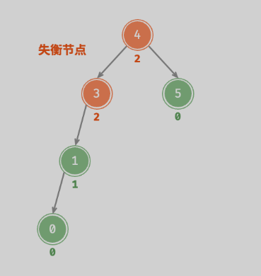
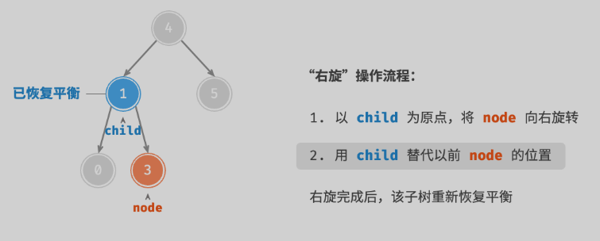
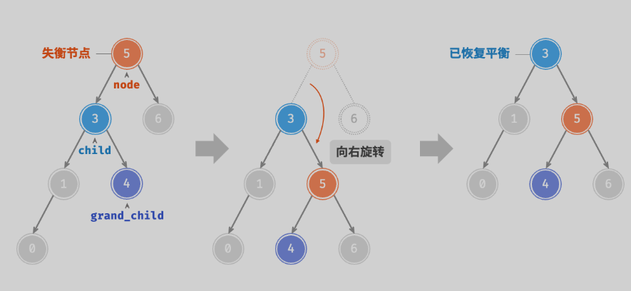
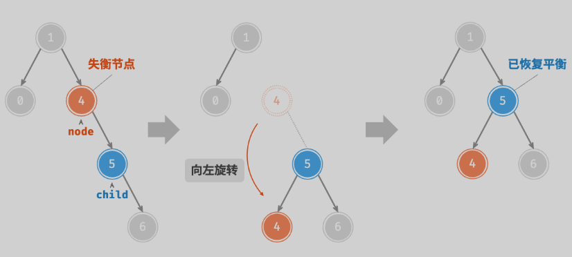
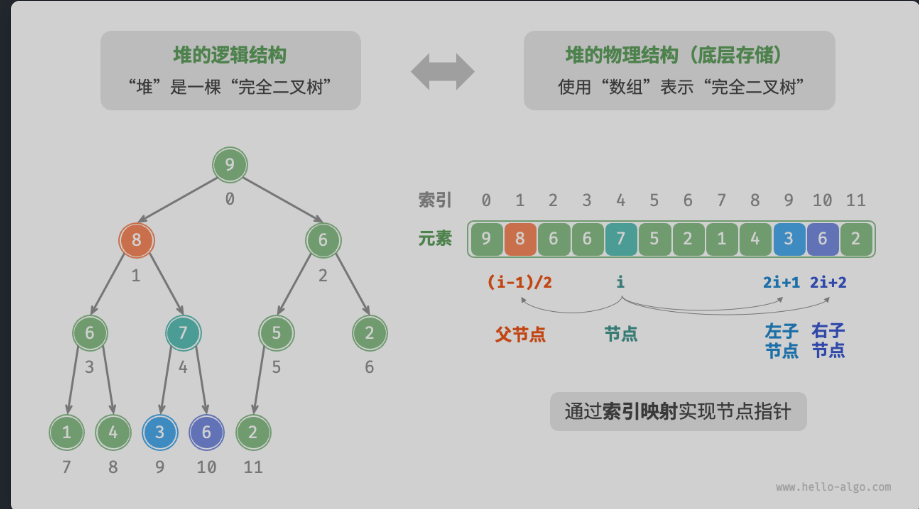
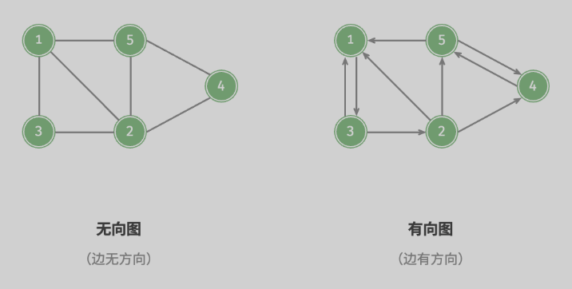
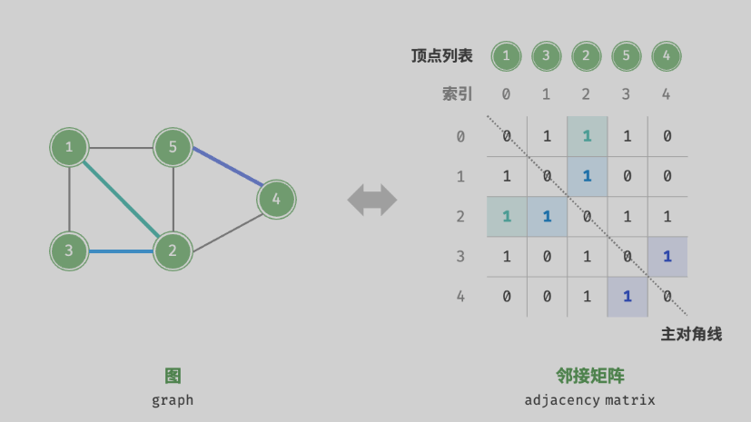
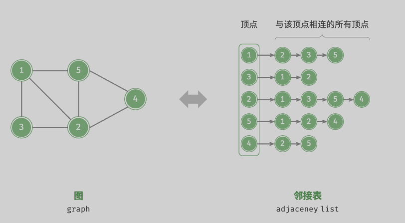

## //参考资料
https://blog.algomooc.com/LeetCode/%E7%AC%AC%E4%B8%80%E5%91%A8/%E7%AC%AC%E4%BA%8C%E5%A4%A9/LeetCode%2027%E3%80%81%E7%A7%BB%E9%99%A4%E5%85%83%E7%B4%A0.html#%E4%B8%80%E3%80%81%E9%A2%98%E7%9B%AE%E6%8F%8F%E8%BF%B0
https://github.com/doocs/leetcode/blob/main/solution/README.md
https://greyireland.gitbook.io/algorithm-pattern/

学习参考

```
基础知识学习
https://www.hello-algo.com/chapter_array_and_linkedlist/array/#2
https://visualgo.net/zh/heap
刷题
https://leetcode.cn/studyplan/selected-coding-interview/
```

## 问题:

+ 编译此项目遇到的问题

```
"{" 与文件结尾不匹配   常量中有换行符  都是与 编码是unicode有关，保存为GB2312即可
```


## 数据结构与算法

### 1.时间复杂度
?	时间复杂度分析统计的不是算法运行时间，**而是算法运行时间随着数据量变大时的增长趋势**。


### 数字编码

**数字是以“补码”的形式存储在计算机中的**


### 数组

```
是一种线性结构   相同类型的元素连续存储在内存空间。
优点:
 访问速度快。
缺点:
 1.插入和删除时间复杂度高 O(n)
 2.长度固定不可变   在申请空间大于实际使用空间时会造成空间浪费
```

### 链表

```c++
线性结构  每个元素都是一个节点 每个节点包含一个指向下一个节点得指针
内存空间分散

/* 链表节点结构体 */
struct ListNode {
    int val;         // 节点值
    ListNode *next;  // 指向下一节点的指针
    ListNode(int x) : val(x), next(nullptr) {}  // 构造函数
};

链表和数组对比:====
			  数组						  链表
存储方式	连续内存空间				  	 分散内存空间
容量扩展	长度不可变						可灵活扩展
内存效率	元素占用内存少、但可能浪费空间		元素占用内存多
访问元素	O(1)							O(n)
添加元素	O(n)							O(1)	
删除元素	O(n)							O(1)	

==================
类型:单向  环形  双向
应用:栈与队列,栈与队列,图
```

### 列表

```
抽象的存储结构 表示元素的有序集合。  比如C++里的vector
```

### 栈

```
先入后出

操作: 入栈 出栈  访问栈顶元素
```

###　队列

```
先入先出的线性数据结构
队列头部作为队首  队列尾部作为队尾
从队头出队,从队尾入队

操作:  入队 出队 访问队首元素
```

### 哈希表

存储 键和值   key-> 映射关系(hash函数)   得到值

```
哈希冲突: 多个key通过函数得到的地址相同。


哈希函数:
1）直接定址法
取关键字或者关键字的某个线性函数为Hash地址，即Hash(key)=a*key+b

2）除留余数法
如果知道Hash表的最大长度为m，可以取不大于m的最大质数p，然后对关键字进行取余运算，Hash(key)=key%p。
在这里p的选取非常关键，p选择的好的话，能够最大程度地减少冲突，p一般取不大于m的最大质数。

3）平方取中法
对关键字进行平方运算，然后取结果的中间几位作为Hash地址。假如有以下关键字序列{421，423，436}，平方之后的结果为{177241，178929，190096}，那么可以取{72，89，00}作为Hash地址。

4）折叠法
将关键字拆分成几部分，然后将这几部分组合在一起，以特定的方式进行转化形成Hash地址。假如知道图书的ISBN号为8903-241-23，可以将Hash(key)=89+03+24+12+3作为Hash地址。

冲突解决:
开放定址法  取下一个空的地址  fi（key）=（f（key）+di）MOD m（di=1,2,3,……,m-1） 线性探测法
		(参考 大话数据结构 8.11　处理散列冲突的方法 节	)
			
分离链接法（链地址法）   key 相同的用单链表链接

哈希算法避免哈希冲突  MD5、SHA-1、SHA-2 和 SHA-3 


```


?														链地址法图解

```
/* 初始化哈希表 */
unordered_map<int, string> map;

/* 添加操作 */
// 在哈希表中添加键值对 (key, value)
map[12836] = "小哈";
map[15937] = "小";
map[16750] = "小算";
map[13276] = "小法";
map[10583] = "小鸭";

/* 查询操作 */
// 向哈希表中输入键 key ，得到值 value
string name = map[15937];

/* 删除操作 */
// 在哈希表中删除键值对 (key, value)
map.erase(10583);
```


---

### 二叉树

####　1. 概念、常用术语

```

节点所在的「层 level」：从顶至底递增，根节点所在层为 1 。
节点的「度 degree」：节点的子节点的数量。在二叉树中，度的取值范围是 0、1、2 。
二叉树的「高度 height」：从根节点到最远叶节点所经过的边的数量。

种类
 1. 满二叉树    所有层的节点都被完全填满
 2. 完全二叉树  只有最底层的节点未被填满，且最底层节点尽量靠左填充。
 3. 平衡二叉树  任意节点的左子树和右子树的高度之差的绝对值不超过 1 。
```

#### 2.二叉树的遍历

1.层序遍历

```
广度优先遍历 BFS

```

2.前中后序遍历

```
深度优先遍历 DFS
```

数组表示二叉树

```
完美二叉树 当前索引的 左右子树索引为 2i+1 2i+2
父节点 (i-1)/2
```

#### 3.二叉搜索树


1. 对于根节点，左子树中所有节点的值 \(<\) 根节点的值 \(<\) 右子树中所有节点的值。
2. 任意节点的左、右子树也是二叉搜索树，即同样满足条件 `1.` 。
3. 删除节点时   如果节点有两个子节点，则要考虑删除左子树最大节点或者右子树最小节点，并把值覆盖给要删除的节点。

注意： **二叉搜索树的中序遍历序列是升序的**。

#### 4.平衡二叉搜索树 （AVL）  

可以防止二叉树退化为链表

```
/* AVL 树节点类 */
struct TreeNode {
    int val{};          // 节点值
    int height = 0;     // 节点高度
    TreeNode *left{};   // 左子节点
    TreeNode *right{};  // 右子节点
    TreeNode() = default;
    explicit TreeNode(int x) : val(x){}
};

平衡因子 = 左子树高度 - 右子树高度  区间[-1, 1]
当某个节点的平衡因为超出区间，则要进行AVL旋转
```

右旋情况




右旋时，失衡节点左子树的右边有节点时，需要把该节点让入失衡节点的左子树



左旋



先左旋后右旋


先右旋后左旋


---

### 堆

```
大顶堆 任意节点的值 >= 子节点的值
小顶堆 任意节点的值 <= 子节点的值

优先队列由堆实现

堆顶：  根节点
堆底:   底层最右边的节点

应用:
	优先队列  堆排 获取最大的k个元素
```



top-k问题：

```
给定一个长度为 的无序数组 nums ，请返回数组中最大的个元素。
算法:
	使用一个堆
```


---

### 图

```
非线性数据结构 由 边 点构成。
分为有向图 无向图

邻接: 顶点通过边和顶点连接
路径： 顶点a到顶点b经过的路径
度: 顶点拥有的边数

图的应用: 社交网络的好友推荐  地铁线路最短路线 
```



邻接矩阵


邻接表



图的遍历

```
BFS 广度优先遍历
1.顶点放入队列
2.顶点出队，并把邻接点放入队列，并记录顶点已经被访问。
DFS 深度优先遍历
一直遍历节点的相邻节点。 没有了就返回。
```


---

### 算法

#### 1.排序算法


#### 2.查找算法


```
线性搜索
    通用性较好，无须任何数据预处理操作。假如我们仅需查询一次数据，那么其他三种方法的数据预处理的时间比线性搜索的时间还要更长。
    适用于体量较小的数据，此情况下时间复杂度对效率影响较小。
    适用于数据更新频率较高的场景，因为该方法不需要对数据进行任何额外维护。
二分查找
    适用于大数据量的情况，效率表现稳定，最差时间复杂度为 \(O(\log n)\) 。
    数据量不能过大，因为存储数组需要连续的内存空间。
    不适用于高频增删数据的场景，因为维护有序数组的开销较大。
    仅适用于有序数据，数组
哈希查找	
    适合对查询性能要求很高的场景，平均时间复杂度为 \(O(1)\) 。
    不适合需要有序数据或范围查找的场景，因为哈希表无法维护数据的有序性。
    对哈希函数和哈希冲突处理策略的依赖性较高，具有较大的性能劣化风险。
    不适合数据量过大的情况，因为哈希表需要额外空间来最大程度地减少冲突，从而提供良好的查询性能。
树查找
    适用于海量数据，因为树节点在内存中是分散存储的。
    适合需要维护有序数据或范围查找的场景。
    在持续增删节点的过程中，二叉搜索树可能产生倾斜，时间复杂度劣化至 \(O(n)\) 。
    若使用 AVL 树或红黑树，则各项操作可在 \(O(\log n)\) 效率下稳定运行，但维护树平衡的操作会增加额外的开销。
```


3.分治